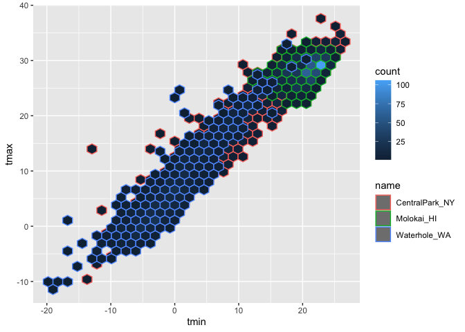

Visualization_1
================

``` r
library(tidyverse)
```

    ## ── Attaching core tidyverse packages ──────────────────────── tidyverse 2.0.0 ──
    ## ✔ dplyr     1.1.4     ✔ readr     2.1.5
    ## ✔ forcats   1.0.0     ✔ stringr   1.5.1
    ## ✔ ggplot2   3.5.2     ✔ tibble    3.3.0
    ## ✔ lubridate 1.9.4     ✔ tidyr     1.3.1
    ## ✔ purrr     1.1.0     
    ## ── Conflicts ────────────────────────────────────────── tidyverse_conflicts() ──
    ## ✖ dplyr::filter() masks stats::filter()
    ## ✖ dplyr::lag()    masks stats::lag()
    ## ℹ Use the conflicted package (<http://conflicted.r-lib.org/>) to force all conflicts to become errors

``` r
library(ggridges)
library(p8105.datasets)

data("weather_df")
weather_df
```

    ## # A tibble: 2,190 × 6
    ##    name           id          date        prcp  tmax  tmin
    ##    <chr>          <chr>       <date>     <dbl> <dbl> <dbl>
    ##  1 CentralPark_NY USW00094728 2021-01-01   157   4.4   0.6
    ##  2 CentralPark_NY USW00094728 2021-01-02    13  10.6   2.2
    ##  3 CentralPark_NY USW00094728 2021-01-03    56   3.3   1.1
    ##  4 CentralPark_NY USW00094728 2021-01-04     5   6.1   1.7
    ##  5 CentralPark_NY USW00094728 2021-01-05     0   5.6   2.2
    ##  6 CentralPark_NY USW00094728 2021-01-06     0   5     1.1
    ##  7 CentralPark_NY USW00094728 2021-01-07     0   5    -1  
    ##  8 CentralPark_NY USW00094728 2021-01-08     0   2.8  -2.7
    ##  9 CentralPark_NY USW00094728 2021-01-09     0   2.8  -4.3
    ## 10 CentralPark_NY USW00094728 2021-01-10     0   5    -1.6
    ## # ℹ 2,180 more rows

## Basic Scatterplot

Only create blank canvas:

``` r
ggplot(weather_df, aes(x = tmin, y = tmax))
```

<!-- --> Add
`geom_point`

``` r
ggplot(weather_df, aes(x = tmin, y = tmax)) + 
  geom_point()
```

    ## Warning: Removed 17 rows containing missing values or values outside the scale range
    ## (`geom_point()`).

<!-- -->
Easier just pipe in:

``` r
weather_df |>
  ggplot(aes(x = tmin, y = tmax)) + 
  geom_point()
```

    ## Warning: Removed 17 rows containing missing values or values outside the scale range
    ## (`geom_point()`).

<!-- --> Save
the plot by assigning it to an object: Call it again to put it from
“Value” to “Data” at “Environment

``` r
ggp_weather = 
  weather_df |>
  ggplot(aes(x = tmin, y = tmax)) 

ggp_weather + geom_point()
```

    ## Warning: Removed 17 rows containing missing values or values outside the scale range
    ## (`geom_point()`).

<!-- -->
Check that some rows are missing:

``` r
weather_df |>
  filter(is.na(tmax))
```

    ## # A tibble: 17 × 6
    ##    name         id          date        prcp  tmax  tmin
    ##    <chr>        <chr>       <date>     <dbl> <dbl> <dbl>
    ##  1 Molokai_HI   USW00022534 2022-05-31    NA    NA    NA
    ##  2 Waterhole_WA USS0023B17S 2021-03-09    NA    NA    NA
    ##  3 Waterhole_WA USS0023B17S 2021-12-07    51    NA    NA
    ##  4 Waterhole_WA USS0023B17S 2021-12-31     0    NA    NA
    ##  5 Waterhole_WA USS0023B17S 2022-02-03     0    NA    NA
    ##  6 Waterhole_WA USS0023B17S 2022-08-09    NA    NA    NA
    ##  7 Waterhole_WA USS0023B17S 2022-08-10    NA    NA    NA
    ##  8 Waterhole_WA USS0023B17S 2022-08-11    NA    NA    NA
    ##  9 Waterhole_WA USS0023B17S 2022-08-12    NA    NA    NA
    ## 10 Waterhole_WA USS0023B17S 2022-08-13    NA    NA    NA
    ## 11 Waterhole_WA USS0023B17S 2022-08-14    NA    NA    NA
    ## 12 Waterhole_WA USS0023B17S 2022-08-15    NA    NA    NA
    ## 13 Waterhole_WA USS0023B17S 2022-08-16    NA    NA    NA
    ## 14 Waterhole_WA USS0023B17S 2022-08-17    NA    NA    NA
    ## 15 Waterhole_WA USS0023B17S 2022-08-18    NA    NA    NA
    ## 16 Waterhole_WA USS0023B17S 2022-08-19    NA    NA    NA
    ## 17 Waterhole_WA USS0023B17S 2022-12-31    76    NA    NA

## Advanced Scatterplot

`geom_point`adding color point based on variable group

``` r
ggplot(weather_df, aes(x = tmin, y = tmax)) + 
  geom_point(aes(color = name))
```

    ## Warning: Removed 17 rows containing missing values or values outside the scale range
    ## (`geom_point()`).

<!-- -->

Define aesthetics can matter: `alpha` to show different density
`geom_smooth` to add smooth curve fits the scatters, but not very
trustworthy `geom_smooth(se = FALSE)`to remove susceptible error ban
`color = name` give different color based on variable `name`

``` r
ggplot(weather_df, aes(x = tmin, y = tmax)) + 
  geom_point(aes(color = name), alpha = .5) +
  geom_smooth(se = FALSE)
```

    ## `geom_smooth()` using method = 'gam' and formula = 'y ~ s(x, bs = "cs")'

    ## Warning: Removed 17 rows containing non-finite outside the scale range
    ## (`stat_smooth()`).

    ## Warning: Removed 17 rows containing missing values or values outside the scale range
    ## (`geom_point()`).

<!-- -->

Use faceting real quick: `facet_grid`to split into multiple plots by
subgroups:

``` r
ggplot(weather_df, aes(x = tmin, y = tmax, color = name)) + 
  geom_point(alpha = .5) +
  geom_smooth(se = FALSE) + 
  facet_grid(. ~ name)
```

    ## `geom_smooth()` using method = 'loess' and formula = 'y ~ x'

    ## Warning: Removed 17 rows containing non-finite outside the scale range
    ## (`stat_smooth()`).

    ## Warning: Removed 17 rows containing missing values or values outside the scale range
    ## (`geom_point()`).

<!-- -->
`facet_grid(name ~ .)` to show each subgroup in rows

``` r
ggplot(weather_df, aes(x = tmin, y = tmax, color = name)) + 
  geom_point(alpha = .5) +
  geom_smooth(se = FALSE) + 
  facet_grid(name ~ .)
```

    ## `geom_smooth()` using method = 'loess' and formula = 'y ~ x'

    ## Warning: Removed 17 rows containing non-finite outside the scale range
    ## (`stat_smooth()`).

    ## Warning: Removed 17 rows containing missing values or values outside the scale range
    ## (`geom_point()`).

<!-- -->
`x = date` change x variable to shows how y changes in the time of year
`size = prcp` shows information about percipertation

``` r
ggplot(weather_df, aes(x = date, y = tmax, color = name, shape = name)) + 
  geom_point(aes(size = prcp), alpha = .5) +
  geom_smooth(se = FALSE) + 
  facet_grid(. ~ name)
```

    ## `geom_smooth()` using method = 'loess' and formula = 'y ~ x'

    ## Warning: Removed 17 rows containing non-finite outside the scale range
    ## (`stat_smooth()`).

    ## Warning: Removed 19 rows containing missing values or values outside the scale range
    ## (`geom_point()`).

<!-- -->

Learning Assignment Code: Write a code chain that starts with
weather_df; focuses only on Central Park, converts temperatures to
Fahrenheit, makes a scatterplot of min vs. max temperature, and overlays
a linear regression line (using options in geom_smooth()).

`geom_smooth(method()` Smoothing method (function) to use, accepts
either NULL or a character vector, e.g. “lm”, “glm”, “gam”, “loess” or a
function `geom_smooth(se = )` Display confidence interval around smooth?
(TRUE by default, see `level` to control.)

``` r
weather_df |> 
  filter(name == "CentralPark_NY") |> 
  mutate(
    tmax_fahr = tmax * (9 / 5) + 32,
    tmin_fahr = tmin * (9 / 5) + 32) |> 
  ggplot(aes(x = tmin_fahr, y = tmax_fahr)) +
  geom_point(alpha = .5) + 
  geom_smooth(method = "lm", se = FALSE)
```

    ## `geom_smooth()` using formula = 'y ~ x'

<!-- -->

## Small things

you can also remove the points, or change the order of`point` and
`smooth` depend on the order you put

``` r
weather_df |> 
  ggplot(aes(x = tmin, y = tmax, color = name, shape = name)) +
 # geom_point(alpha = .5) + 
  geom_smooth(se = FALSE)
```

    ## `geom_smooth()` using method = 'loess' and formula = 'y ~ x'

    ## Warning: Removed 17 rows containing non-finite outside the scale range
    ## (`stat_smooth()`).

<!-- -->

Show density of how data clusters:

``` r
weather_df |> 
  ggplot(aes(x = tmin, y = tmax, color = name, shape = name)) +
  geom_hex()
```

    ## Warning: Removed 17 rows containing non-finite outside the scale range
    ## (`stat_binhex()`).

<!-- -->
Color the points: `color` worked for both `geom_point()` and
`geom_smooth()`, but `shape` only applies to `geom_point`

``` r
weather_df |> 
  ggplot(aes(x = tmin, y = tmax, color = name, shape = name)) +
  geom_point(color = "purple")
```

    ## Warning: Removed 17 rows containing missing values or values outside the scale range
    ## (`geom_point()`).

<!-- -->

## Odds and ends

No `geom_point`, instead using `geom_smooth` directly

``` r
ggplot(weather_df, aes(x = date, y = tmax, color = name)) + 
  geom_smooth(se = FALSE) 
```

    ## `geom_smooth()` using method = 'loess' and formula = 'y ~ x'

    ## Warning: Removed 17 rows containing non-finite outside the scale range
    ## (`stat_smooth()`).

<!-- -->

`geom_hex()`, `geom_bin2d()`, or `geom_density2d()` all can use to avoid
overplotting

``` r
ggplot(weather_df, aes(x = tmax, y = tmin)) + 
  geom_hex()
```

    ## Warning: Removed 17 rows containing non-finite outside the scale range
    ## (`stat_binhex()`).

<!-- -->

Learning Assignment Code:

``` r
ggplot(weather_df) + geom_point(aes(x = tmax, y = tmin), color = "blue")
```

    ## Warning: Removed 17 rows containing missing values or values outside the scale range
    ## (`geom_point()`).

<!-- -->

``` r
ggplot(weather_df) + geom_point(aes(x = tmax, y = tmin, color = "blue"))
```

    ## Warning: Removed 17 rows containing missing values or values outside the scale range
    ## (`geom_point()`).

<!-- -->

## Univariate Plots

Making histogram, no need to mention y-axis, it auto counts.

``` r
ggplot(weather_df, aes(x = tmax)) + 
  geom_histogram()
```

    ## `stat_bin()` using `bins = 30`. Pick better value with `binwidth`.

    ## Warning: Removed 17 rows containing non-finite outside the scale range
    ## (`stat_bin()`).

<!-- -->
`color` the bound, and `fill` color the area inside the bound:

``` r
ggplot(weather_df, aes(x = tmax)) + 
  geom_histogram(color = "purple", fill = "red")
```

    ## `stat_bin()` using `bins = 30`. Pick better value with `binwidth`.

    ## Warning: Removed 17 rows containing non-finite outside the scale range
    ## (`stat_bin()`).

<!-- -->

Stack and differnetiate subgroups by color

``` r
ggplot(weather_df, aes(x = tmax, fill = name)) + 
  geom_histogram(position = "dodge", binwidth = 2)
```

    ## Warning: Removed 17 rows containing non-finite outside the scale range
    ## (`stat_bin()`).

<!-- -->

Density plot:

``` r
ggplot(weather_df, aes(x = tmax, fill = name)) + 
  geom_density(alpha = .4, adjust = .5, color = "blue")
```

    ## Warning: Removed 17 rows containing non-finite outside the scale range
    ## (`stat_density()`).

<!-- -->

Box plot: `x = name` separate by subgroup variable - name

``` r
ggplot(weather_df, aes(x = name, y = tmax)) + 
  geom_boxplot(aes(fill = name))
```

    ## Warning: Removed 17 rows containing non-finite outside the scale range
    ## (`stat_boxplot()`).

<!-- -->

Violin Plots:(vertical version of density plot)

``` r
ggplot(weather_df, aes(x = name, y = tmax)) + 
  geom_violin(aes(fill = name), alpha = .5) + 
  stat_summary(fun = "median", color = "blue")
```

    ## Warning: Removed 17 rows containing non-finite outside the scale range
    ## (`stat_ydensity()`).

    ## Warning: Removed 17 rows containing non-finite outside the scale range
    ## (`stat_summary()`).

    ## Warning: Removed 3 rows containing missing values or values outside the scale range
    ## (`geom_segment()`).

<!-- -->
Ridge Plot: nice if you have lots of categories in which the shape of
the distribution matters

``` r
ggplot(weather_df, aes(x = tmax, y = name)) + 
  geom_density_ridges(scale = .85)
```

    ## Picking joint bandwidth of 1.54

    ## Warning: Removed 17 rows containing non-finite outside the scale range
    ## (`stat_density_ridges()`).

<!-- -->

## Show a ZOOM-IN verison of plot

Filter out data in the end (long tails):

``` r
weather_df |>
  filter(prcp > 5, prcp < 1000) |>
  ggplot (aes(x = prcp, fill = name)) +
  geom_density(alpha = 0.2)
```

<!-- -->

## Saving and embedding plots

``` r
ggp_weather = 
  ggplot(weather_df, aes(x = tmin, y = tmax)) + 
  geom_point(aes(color = name), alpha = .5) 

ggsave("ggp_weather.pdf", ggp_weather, width = 8, height = 5)
```

    ## Warning: Removed 17 rows containing missing values or values outside the scale range
    ## (`geom_point()`).

Embedding plots in an R Markdown document: `fig.width`, `fig.height`,
and `fig.asp` control the size of the figure created by R `out.width` or
`out.heigh` control size of the figure inserted into your document

``` r
knitr::opts_chunk$set(
  fig.width = 6,
  fig.asp = .6,
  out.width = "90%"
)
```

Font and point size in the figures generated by R are constant, they
don’t scale with the overall size of the figure. \*Text in a figure with
width 12 will look smaller than text in a figure with width 6 after both
have been embedded in a document

``` r
ggplot(weather_df, aes(x = tmin, y = tmax)) + 
  geom_point(aes(color = name))
```

    ## Warning: Removed 17 rows containing missing values or values outside the scale range
    ## (`geom_point()`).


